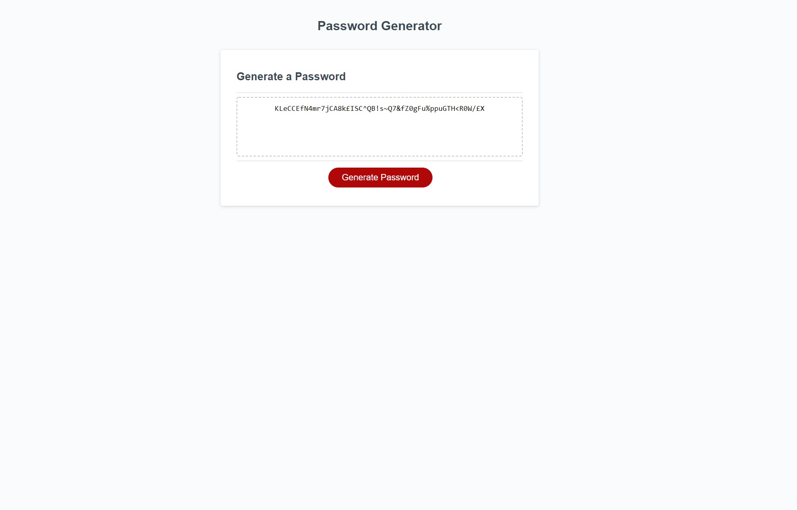

<h1>JavaScript Password Generator</h1>

<h2>User Story</h2>

AS AN employee with access to sensitive data
I WANT to randomly generate a password that meets certain criteria
SO THAT I can create a strong password that provides greater security

<h2>Acceptance Criteria</h2>

- GIVEN I need a new, secure password
- WHEN I click the button to generate a password
- THEN I am presented with a series of prompts for password criteria
- WHEN prompted for password criteria
- THEN I select which criteria to include in the password
- WHEN prompted for the length of the password
- THEN I choose a length of at least 8 characters and no more than 128 characters
- WHEN asked for character types to include in the password
- THEN I confirm whether or not to include lowercase, uppercase, numeric, and/or special characters
- WHEN I answer each prompt
- THEN my input should be validated and at least one character type should be selected
- WHEN all prompts are answered
- THEN a password is generated that matches the selected criteria
- WHEN the password is generated
- THEN the password is either displayed in an alert or written to the page

<h2>What was done</h2>

- Variables were created named passwordLength and empty (which is an empty array).
- Constants were created named upperCase, lowerCase, specialCharacter and number. These are arrays containing upper case, lower case special character and numbers respectivly.
- withing the function writePassword the getPrompt function is called so the promppts are triggered wehen the button is clicked.
- getPrompt fuinction was created to allow the user to input their variables
- within get prompt two if statments have been created to prevent the user from inputing values for the length of the password that are lower than 8 charcters and higher than 128 characters
- the password will now display on the screen with the users selected preferences 

<a href = "https://josephbalshaw.github.io/Uncle-Joes-password-generator/">Deployed</a>

